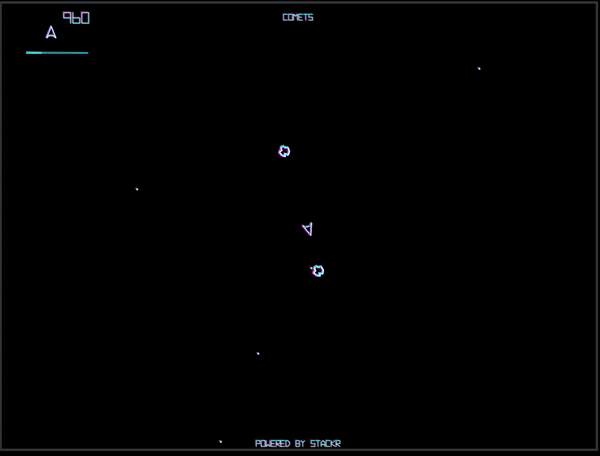

# Comets



Comets is a fully-onchain space-themed game rollup inspired by the classic Asteroids.
Navigate through a field of asteroids, blast them into smaller pieces, and watch out for alien ships!

## Controls

- Press `ENTER` button to start the game
- Rotate: Left/Right arrow keys or A and D
- Thrust: Up arrow or W
- Fire: Space bar
- Hyperspace: CTRL

Every step of your gameplay is recorded and verified on-chain so that your score is unspoofable and your legendary run will be remembered forever!

Play it here: https://comets.stf.xyz/

## Development

Comets is composed of two parts:

- a frontend game client
- a micro-rollup web server

To run it locally, you need to first spin up the rollup.

```shell
cd game
vim .env
# set up your rollup config
# add PRIVATE_KEY=<your-private-key>
npm i
# start the rollup server
npm start
```

The server should be running on port 3210 by default.

Now run the Next.js app.

```shell
cd client
vim game/src/api.ts
# set API_URL=http://localhost:3210
npm install
npm run dev
```

And voila! You're ready to play on your local machine at http://localhost:3000.

## Deployment

To deploy your own version of Comets on Sepolia, make sure to properly setup your config by following this [step](https://docs.stf.xyz/build/zero-to-one/build-your-first-mru#setting-up-your-config).

Then, follow the remaining guide to deploy your very own Comets rollup.
